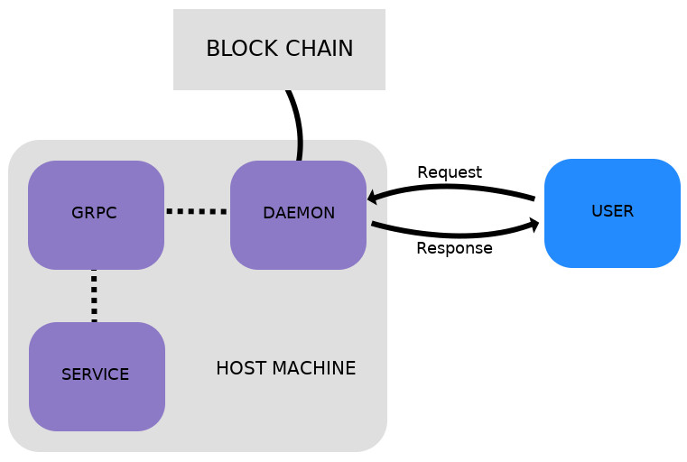

[author-home]: http://alysson.thegeneralsolution.com
[singularitynet-home]: https://www.singularitynet.io
[contribution-guidelines]: https://github.com/singnet/wiki/blob/master/guidelines/CONTRIBUTING.md
[cpp-tutorial]: https://github.com/singnet/wiki/tree/master/tutorials/howToWriteCPPService
[setup-script]: https://github.com/singnet/time-series-anomaly-discovery/blob/master/setup.sh
[service_confi_file]: https://github.com/singnet/time-series-anomaly-discovery/blob/master/service_conf

[sequitur_docs]: https://github.com/singnet/time-series-anomaly-discovery/blob/master/docs/sequitur.md
[sax_docs]: https://github.com/singnet/time-series-anomaly-discovery/blob/master/docs/sax.md
[paa_docs]: https://github.com/singnet/time-series-anomaly-discovery/blob/master/docs/paa.md
[densitycurve_docs]: https://github.com/singnet/time-series-anomaly-discovery/blob/master/docs/densitycurve.md
[erdb_docs]: https://github.com/singnet/time-series-anomaly-discovery/blob/master/docs/erdb.md
[users_guide]: https://github.com/singnet/time-series-anomaly-discovery/blob/master/docs/usersguide.md

[singnet_service_tutorial]:https://dev.singularitynet.io/tutorials/publish/

[](https://circleci.com/gh/singnet/time-series-anomaly-discovery)

# Time Series Anomaly Discovery Service to SingularityNET

A [SingularityNET][singularitynet-home] service is composed of three main pilars as depicted in Figure 1. Those are the DAEMON, GRPC server, and the service. The Daemon is responsible to receive external requests from users, usually through the internet, and send them to the local service GRPC server. The server will call the service locally and return a response to the DAEMON. This response is sent by the DAEMON to the caller user as the service processed information.

<p align="center">
 
</p>

<p align="center">
  Figure 1 - Service architecture and communication between an user, daemon, and GRPC server.
</p>

*<strong>It is important to note that operations performed by the DAEMON may interact with the blockchain and has a price associated with it.</strong>*

Simply put, this project contains a [C++ service][cpp-tutorial] to discover time series anomalies in real-time. It was tested on Ubuntu 18.04 and requires at least the C++ GRPC library and the DAMEON installed to be built and executed. 

Table of contents

<!--ts-->
   * [Dependencies](#Dependencies)
   * [Getting Started](#getting-started)
   * [Building](#building)
   * [Running](#running)
   * [Publishing](#publishing)
   * [Perfoming a Test Request](#performing-a-test-request)
   * [Docker](#docker)
   * [Contributing and Reporting Issues](#contributing-and-reporting-issues)
   * [Author](#author)
   * [References](#references)
   * [License](#license)
<!--te-->

# Dependencies

For the sake of simplicity, this service provides a 'setup.sh' script. This script can be used to install all dependencies, compile the source, perform tests, run the service, and publish it.

In order to install all dependencies, use the following command.

```
sudo ./setup.sh -i
```

Basically, this command will install the GRPC c++ library, the DAEMON to handle requests, and the snet cli to manage the blockchain related stuff.

<details><summary>Click here to see the commands called by './setup.sh -i'</summary><p>
    
```
# update packages list
apt-get update;\

# try to install all recommended software
apt-get install -y nlohmann-json-dev build-essential autoconf libtool pkg-config \
                   libgflags-dev libgtest-dev clang libc++-dev git curl nano \
                   wget libudev-dev libusb-1.0-0-dev nodejs npm python3 python3-pip libboost-all-dev;\

# try upgrade pip
pip install --upgrade pip; \

# install GRPC library
cd /;\
git clone -b $(curl -L https://grpc.io/release) https://github.com/grpc/grpc; \
cd grpc; \
git submodule update --init; \
make; \
make install; \
cd third_party/protobuf; \
make install; \
cd /;\

# install snet daemon to call for services
mkdir snet-daemon; \
cd snet-daemon; \
wget -q https://github.com/singnet/snet-daemon/releases/download/v0.1.5/snet-daemon-v0.1.5-linux-amd64.tar.gz; \
tar -xvf snet-daemon-v0.1.5-linux-amd64.tar.gz; \
mv ./snet-daemon-v0.1.5-linux-amd64/snetd /usr/bin/snetd; \
cd ..; \
rm -rf snet-daemon; \

# install cli to handle services publishing and other related operations
cd /opt; \
git clone https://github.com/singnet/snet-cli; \
cd snet-cli; \
./scripts/blockchain install; \
pip3 install -e .; \
```
</p></details>

## Getting Started

This service allows to detect anomalies in time series as accomplished by [[1]](#anomalies_detection_general), based on grammar compression. It contains [SingularityNet][singularitynet-home] implementation of the following algorithms and methods.

[Symbolic Aggregate Approximation][sax_docs] - Discretization method for continuous signals [[2]](#sax).

[Piecewise Aggregate Approximation][paa_docs] - Series approximation and reduction method [[3]](#paa).

[Sequitur][sequitur_docs] - Context Free Grammar Generator [[4]](#sequitur).

[Density Curve][densitycurve_docs] - Density curve generator based on context free grammar rules [[1]](#anomalies_detection_general).

[Efficient, rule density-based anomaly discovery][erdb_docs] - Detect anomalies on a generated density curve, based on a hill-climbing inspired algorithm [[1]](#anomalies_detection_general).

For a detailed explanation about how this service works see the [users guide][users_guide].

## Building

To build this project's source and perform tests, run the following command in the project's root directory.


```
./setup.sh -c
```

Besides building the source, this command will check the responsiveness of real requests to this service GRPC server.

<details><summary>Click here to see the commands called by './setup.sh -c'</summary><p>
    
```
# build source
make clean; make

# run tests
./bin/deployTests
```
</p></details>

## Running

In order to build and get this service running, run the [setup.sh][setup-script] script located in the project's root directory with the *-r* flag. This flag will force the source to be built, perform tests, the localhost GRPC server, and the DAEMON to handle requests to this service.


```
./setup.sh -r
```

It is important to note that the DAEMON listen to outside requests and the GRPC will only listen requests at the localhost address. Both are initially configurated to listen at 54.203.198.53:7090 and 0.0.0.0:7055, respectively. For more info about how to configure the service see the [service configuration file][service_confi_file].

<details><summary>Click here to see the commands called by './setup.sh -r'</summary><p>
    
```
# create snet daemon snetd.config.json file
createDeamonConfig

# run daemon in background
snetd --config snetd.config.json &

# run the service local server in background
./bin/server &
```
</p></details>

## Publishing

To publish variants of this service, call the following.


```
./setup.sh -p
```

This command will publish the service with the specified information in [service configuration file][service_confi_file] located in the project's root directory. Just remember that in order to publish a service, you firstly need a valid identity and [service configuration file][service_confi_file].

<details><summary>Click here to see the commands called by './setup.sh -p'</summary><p>
    
```
# delete service before trying to publish it
snet service delete $ORGANIZATION_TO_PUBLISH_VAR $SERVICE_NAME_VAR -y

# create metadata json for this service with its name and the wallet that will receive money
snet service metadata-init src/service_spec $SERVICE_NAME_VAR $WALLET_VAR

# set the price to use this service
snet service metadata-set-fixed-price $PRICE_VAR

# set the local port to access this service server
snet service metadata-add-endpoints https://$HOST_IP_ADDRESS_VAR:$SERVICE_DAEMON_PORT_VAR

# publish the service at the specified organization
snet service publish $ORGANIZATION_TO_PUBLISH_VAR $SERVICE_NAME_VAR -y
```
</p></details>

## Performing a test request

To perform a test request, run the following command.

```
./setup.sh -e
```
This will do a request to this service DAEMON, already published at snet, with the default input parameter at the DAEMON address specified in the [service configuration file][service_confi_file].

*A call for this service is free, however in order for this to work you need to have a valid identity/account.*

For more info regargind service calls, publication, DAEMON working, and how to create identities/accounts, see [Sigularity Net Service Tutorial][singnet_service_tutorial].

<details><summary>Click here to see the commands called by './setup.sh -e'</summary><p>
    
```
echo
echo "Running a test call to this service daemon with the specified data in the 'service_conf' file."

# open a channel with the deposited amount to call for this service
CHANNEL_TIME_OUT=11000000
RESPONSE="$(snet channel open-init $ORGANIZATION_TO_PUBLISH_VAR $SERVICE_NAME_VAR $PRICE_VAR $CHANNEL_TIME_OUT -y)"

# get channel ID from the last substring obtained from the RESPONSE variable
RESPONSES=( $RESPONSE )
LENGTH=${#RESPONSES[@]}
CHANNEL_ID_INDEX=$(($LENGTH - 1))
CHANNEL_ID=${RESPONSES[$(($LENGTH - 1))]}

# call for the created service
DAEMON_RESPONSE="$(snet client call "$CHANNEL_ID" "$PRICE_VAR" "$HOST_IP_ADDRESS_VAR:$SERVICE_DAEMON_PORT_VAR" "$TEST_CALL_METHOD_VAR" "$TEST_CALL_INPUT_VAR")"

# print response from daemon
echo
echo "Daemon response:"
echo
echo $DAEMON_RESPONSE
echo
```
</p></details>

## Docker
This project also provides a Dockerfile to allow to create docker images for this service. The commands bellow can be used to build an image and run a container based on it.

```
# build the docker image
docker build -t times-series-anomaly--image:dev .

# run the container and service
docker run -tdi --name time-series-anomaly-discovery-container times-series-anomaly-discovery-image:dev

# enter the container
docker exec -it time-series-anomaly-discovery-container /bin/bashdiscovery
```

The name given to the image and container could be changed according to the user's necessity.

## Contributing and Reporting Issues

Please read our [guidelines][contribution-guidelines] before
submitting issues or pull requests. 

## Author

[Alysson Ribeiro da Silva][author-home] - *Maintainer* - [SingularityNET][singularitynet-home]

### References

<a name=anomalies_detection_general>[1]</a> Senin, P., Lin, J., Wang, X., Oates, T., Gandhi, S., Boedihardjo, A.P., Chen, C., & Frankenstein, S. (2015). Time series anomaly     discovery with grammar-based compression. EDBT.

<a name=sax>[2]</a> Chaw Thet Zan and Hayato Yamana. 2016. An improved symbolic aggregate approximation distance measure based on its statistical features. In Proceedings of the 18th International Conference on Information Integration and Web-based Applications and Services (iiWAS '16). ACM, New York, NY, USA, 72-80. DOI: https://doi.org/10.1145/3011141.3011146

<a name=paa>[3]</a> Huorong Ren, Xiujuan Liao, Zhiwu Li, and Abdulrahman Ai-Ahmari. 2018. Anomaly detection using piecewise aggregate approximation in the amplitude domain. Applied Intelligence 48, 5 (May 2018), 1097-1110. DOI: https://doi.org/10.1007/s10489-017-1017-x

<a name=sequitur>[4]</a> Craig G. Nevill-Manning and Ian H. Witten. 1997. Identifying hierarchical structure in sequences: a linear-time algorithm. J. Artif. Int. Res. 7, 1 (September 1997), 67-82.

## License

This project is licensed under the MIT License - see the [LICENSE](LICENSE) file for details
