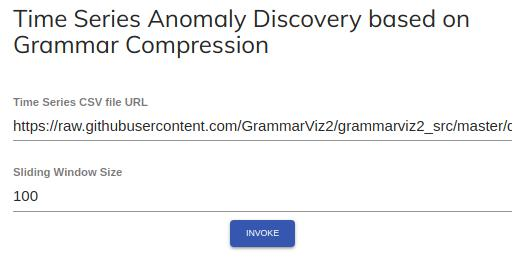
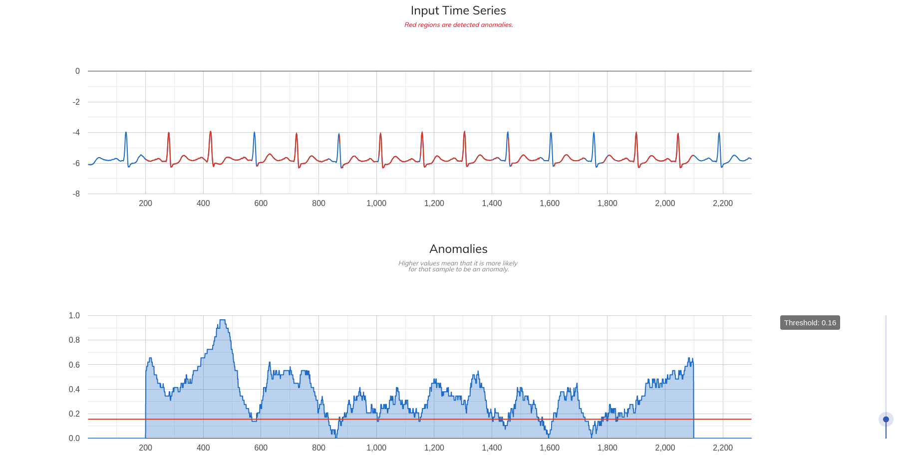
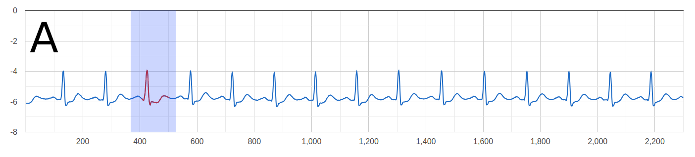
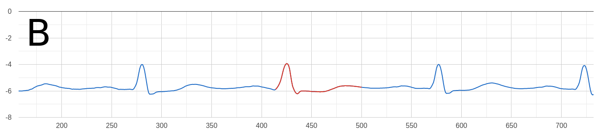
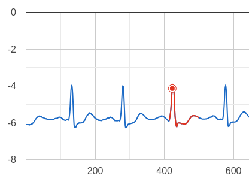
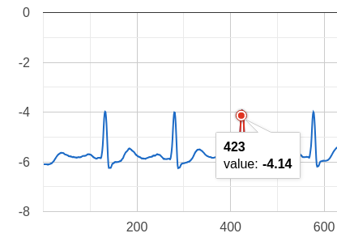

[singularitynet-home]: https://www.singularitynet.io


# Time Series Anomaly Discovery

This service provides a Time Series Anomaly Discovery method to detect anomalies in time series.

### Welcome

This service receives an URL containing a time series in a CSV file format and outputs indexes that indicate the likelihood of each sample to be an anomaly. The results are obtained through a [SingularityNet][singularitynet-home] version of a state of the art grammar-compression method and anomaly discovery based on grammar rules densities.

### What’s the point?

Anomalies are everywhere and can cause death, diseases, disasters, financial crisis, and they represent important events that we should pay attention to. With the deployed technique, anomalies of different sizes can be detected in time series with minimum user interaction. The only thing the user need to do is to specify one parameter and to provide a time series. With this in mind, it is possible to analyse the behavior of a time series in a couple of minutes and yet be able to identify anomalies consistently and efficiently. Besides being able to detect anomalies in a fast fashion, it can be used for a variety of applications, from finances, to ECG analysis, increasing productivity and effectiveness when detecting deficiencies and important events.

### How does it work?

In order to detect anomalies efficiently, the deployed method is based on grammar-compression. The grammar-compression performs a transformation in the received time series samples, reducing its size and grouping similar regions into grammar rules clusters. Those clusters are used to build a grammar rules density curve that is used to detect the anomalies in the original time series. 

For the algorithm to be able perform a grammar-compression over a time series, the user needs to specify an URL containing a valid time series CSV file. As depicted in Fig. 1, this service provides a simple user interface to receive the aforementioned input parameter. It is important to note that to allow the service to detect anomalies, a sliding window is configured with 7% of the total size of the input time series.

<p align="center">
  
  <br/>
  <b>Fig. 1 - Service input interface. The first parameter is an URL containing the time series CSV file.
  </b>
</p>

#### Time series input file and format

The service can handle a maximum of 10000 samples, if the file contains more than that number, the service will process only the first 10000 ones that it reads. This was done to avoid performance issues when displaying the output in the form of interactive charts.

A valid CSV file for this service can not contain a header and each line needs to represent one positive or negative number. Decimal notation may be accomplished by using ‘.’ or ‘,’ and no limit was put on how many places a number may have. However, the service will truncate each value to the size of a 8 bytes number. An example of a valid CSV file is presented below.

<details><summary>Example file</summary><p>

```
-6,095
-2,095
4,1
6,1
2136,095
-1232
-32,11111
-111111
-6,095
-2,095
4,1
6,1
2136,095
-1232
-32,11111
-111111
-6,095
-2,095
4,1
6,1
2136,095
-1232
-32,11111
-111111
```
</p></details>

### What to expect from this service?

In this section is shown some example input parameters for this service.

#### Example input URL containing an ECG exam time series

```
https://raw.githubusercontent.com/singnet/time-series-anomaly-discovery/master/resources/time_series/ecg0606_1.csv
```

#### Example input sliding window size

```
100
```

#### Response for the example input parameters

This service output two interactive charts as depicted in Fig. 2. The top chart represents the original time series and the bottom one represents the rules densities obtained from the compressed grammar. Higher values of the density curve means that it is more likely for that sample to be an anomaly in the original time series. 

<p align="center">
  
  <br/>
  <b>Fig. 2 - Service output interface. The top chart represents the input time series and the bottom one represents the generated grammar rules density curve. Red regions depicted in the time series chart are detected anomalies given a detection threshold. 
  </b>
</p>

Anomalies are highlighted as red zones in the top chart in Fig. 2 and are detected through a threshold. When a sample surpasses the defined threshold in the density curve chart, it is marked in red in the original time series. To change the detection threshold, as depicted in Fig. 3, the bottom right slider can be used.

<p align="center">
  
  <br/>
  <b>Fig. 3 - Anomalies detected after changing the threshold value. 
  </b>
</p>

<!---
#### Interactiveness

This service also allows to interact with the displayed charts with two operations, Zoom and mark.

##### Zooming the response chart

In order to perform a zoom in the original time series chart, hold and drag a region on top of it with the left mouse buttom as depicted in Fig. 4 A. 

<p align="center">
  
  
  <br/>
  <b>Fig. 4 - Time series zooming area created by holding the left mouse button and drag. 
  </b>
</p>

The resultant for this operation is depicted in Fig. 4 B as the zoomed selected region.

##### Inserting reference point

To insert a reference point just press the left mouse button on top of any of the charts line. This will mark it until a new point is assigned as depicted in Fig. 5.

<p align="center">
  
  <br/>
  <b>Fig. 5 - Point marking example. Mark point placed after pressing the left mouse button on top of the original time series chart.
  </b>
</p>

##### Displaying information about a sample

It is also possible to display detailed information about samples just by passing the mouse cursor over any of the chart's lines, as depicted in Fig 6.

<p align="center">
  
  <br/>
  <b>Fig. 6 - Point annotation informing its correct position and value.
  </b>
</p>
-->


